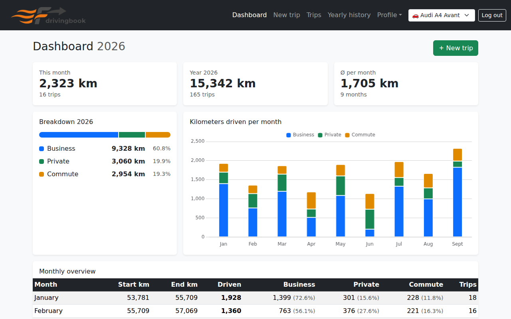

<p align="center">
  
</p>

<h1 align="center">drivingbook</h1>

<p align="center">
  A self-hosted digital vehicle logbook: record trips on your phone in seconds,
  get monthly and yearly reports, export CSV and PDF, and find out whether the
  1% rule or a logbook saves you more tax. No cloud, no subscription.
</p>

<p align="center">
  <a href="https://fabian-born.github.io/drivingbook/">Project page</a> ·
  <a href="https://fabian-born.github.io/drivingbook/demo.html">Live demo</a> ·
  <a href="backend/README.md">Setup &amp; API reference (German)</a>
</p>



## Features

- **Quick entry** – odometer, destination and trip type, then save. The timestamp is set
  automatically; the GPS button fills in the current address (OpenStreetMap / Nominatim).
- **Works offline (PWA)** – installable on the home screen. Trips recorded without a
  connection are queued and sent as soon as you are back online.
- **Three trip types** – business, private and commute, counted separately and
  color-coded in every report.
- **Multiple vehicles** – switch the active vehicle in the navigation; every page then
  shows only its trips.
- **1% rule or logbook?** – from list price, drive type and annual costs, the vehicle info
  page estimates which method is cheaper (combustion, hybrid and electric cars).
  *A simplified estimate, not tax advice.*
- **Pre-tax check** – a traffic light flags odometer decreases, gaps, unusually long trips
  and coordinates instead of addresses.
- **Audit log** – every creation, change and deletion of a trip is recorded with old and
  new values and the source (`web`, `api_token`, `admin`).
- **Export & backup** – CSV and PDF per year, JSON backups of a single vehicle or the whole
  account. Restoring only adds what is missing and never overwrites.
- **API & Home Assistant** – log trips automatically with an API token, e.g. from the
  car's odometer sensor.
- **German & English** – interface, error messages, PDF and CSV in both languages.
- **Light & dark mode** – follows the system setting or can be set manually.
- **Admin tooling** – user management, cleanup of duplicate and unassigned trips, daily
  database backups and a password reset script.
- **Security** – JWT login, hashed API tokens, rate-limited login and sign-up; public
  sign-up can be disabled.

## Architecture

Three containers, orchestrated with Docker Compose:

| Service    | Technology                     | Purpose |
|------------|--------------------------------|---------|
| `db`       | PostgreSQL 16                  | Data storage |
| `backend`  | Node.js 20+, Express           | REST API, migrations, PDF/CSV export |
| `frontend` | nginx, vanilla HTML/JS/CSS     | Web app / PWA; proxies `/api` to the backend |
| `backup`   | PostgreSQL 16 (`pg_dump`)      | Daily gzipped database dumps |

The backend applies all pending SQL migrations from `backend/migrations/` on start, so no
manual schema setup is needed.

## Quick start

Requirements: Docker with Docker Compose.

```bash
git clone https://github.com/fabian-born/drivingbook.git
cd drivingbook
cp .env.example .env
```

Edit `.env` and set at least a strong `DB_PASSWORD` and a `JWT_SECRET` of 32 characters
or more:

```bash
node -e "console.log(require('crypto').randomBytes(32).toString('hex'))"
```

Then start the stack:

```bash
docker compose up -d --build
docker compose logs -f backend
```

The app is available at `http://localhost/` (port configurable via `FRONTEND_PORT`).
On an empty database, the backend creates an admin user. If `ADMIN_PASSWORD` is not set,
a random password is generated and printed once to the backend log.

> PWA features (install, offline mode) require HTTPS or `localhost`.

For a production setup behind Traefik, see `stack-compose.example.yml`. Prebuilt images
are published to GHCR by the CI (`ghcr.io/fabian-born/fahrtenbuch-frontend` and
`ghcr.io/fabian-born/fahrtenbuch-backend`).

### Configuration

| Variable | Description |
|---|---|
| `DB_NAME`, `DB_USER`, `DB_PASSWORD` | Database credentials |
| `JWT_SECRET` | **Required**, at least 32 random characters |
| `JWT_EXPIRES` | Lifetime of a login session (default `8h`) |
| `ADMIN_USERNAME`, `ADMIN_PASSWORD` | Initial admin on an empty database |
| `ALLOW_REGISTRATION` | `false` disables public sign-up |
| `CORS_ORIGIN` | Only needed if the frontend calls the API from another origin |
| `TRUST_PROXY` | Number of reverse proxies in front of the backend (`1` = nginx, `2` = Traefik + nginx) |
| `NOMINATIM_EMAIL` | Contact address for OpenStreetMap reverse geocoding (recommended) |
| `BACKUP_KEEP_DAYS` | Retention of daily database backups (default `14`) |
| `FRONTEND_PORT` | Host port of the web app (default `80`) |

## API

All paths, field names and values are in English. Authenticate with a JWT from
`POST /api/login` or with an API token (created under *Profile → Account → API tokens*):

```bash
curl -X POST https://logbook.example.com/api/trips \
  -H "Authorization: Bearer <API-TOKEN>" \
  -H "Content-Type: application/json" \
  -d '{
    "odometer_km": 65230,
    "destination": "Customer Ltd.",
    "trip_type": "business",
    "timestamp": "2026-09-26T08:30:00Z",
    "vehicle_code": "4GAQAB"
  }'
```

- `trip_type`: `business`, `private` or `commute`.
- `vehicle_code` is the 6-character code shown on the vehicle info page. If omitted, the
  trip goes to the default vehicle; `null` stores it without a vehicle.
- If the odometer reading does not fit the neighbouring trips, the API answers
  `409` with `"code": "KM_PLAUSIBILITY"`. Send `"force": true` to save anyway.

The full endpoint list is in [backend/README.md](backend/README.md). A complete Home
Assistant setup (`rest_command` and automation) is in
[HA_integration.txt](HA_integration.txt).

## Development & tests

API tests (Node.js `node:test` + supertest) need a PostgreSQL instance. **The `public`
schema of the given database is wiped** – never run them against real data.

```bash
docker run -d --rm --name fb-test-db -e POSTGRES_PASSWORD=test -p 127.0.0.1:55432:5432 postgres:16-alpine
cd backend && npm ci
DB_HOST=127.0.0.1 DB_PORT=55432 DB_USER=postgres DB_NAME=postgres DB_PASSWORD=test npm test
```

Browser tests (Playwright) run frontend and backend together; see
[e2e/README.md](e2e/README.md). The CI runs both test suites before building and pushing
images.

Frontend and backend are versioned separately (`YYYY.MM.DD.N` in `release.ver`). A git hook
bumps the version on commit; enable it once per clone:

```bash
git config core.hooksPath .githooks
```

New schema changes go into the next numbered file in `backend/migrations/`. Never modify
migrations that have already been applied.

## Repository layout

```
.
├── backend/        Node.js API, SQL migrations, tests, maintenance scripts
├── frontend/       Static web app (PWA), nginx config
├── e2e/            Playwright browser tests and screenshot generator
├── demo/           Standalone demo stack with hourly data reset
├── docs/           GitHub Pages project site
├── docker-compose.yaml         Local setup
└── stack-compose.example.yml   Template for a Traefik-based deployment
```

## Adding a language

Copy `frontend/lang/de.json` and `backend/src/lang/de.json` to a new language file,
translate them and register the language in a few places – step-by-step instructions are
in [backend/README.md](backend/README.md#11-sprachen). Missing keys fall back to German.

## License

[MIT](LICENSE) © 2026 Fabian Born
